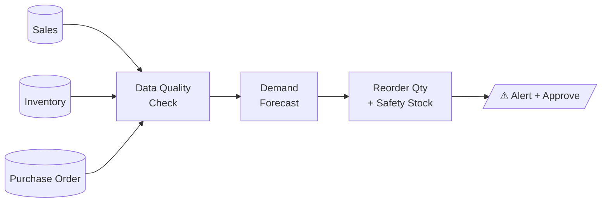
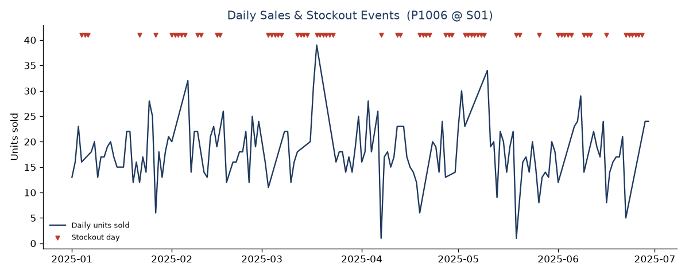

# 📦 Stockout Guard — ระบบจัดการปัญหาสินค้าขาดสต็อกสำหรับ SME ค้าปลีก

> โปรเจกต์ Data Science ที่นำการพยากรณ์ดีมานด์ + การแนะนำการสั่งซื้อ มาช่วยลด
> **สินค้าขาดสต็อก (Stockout)** ซึ่งเป็นสาเหตุอันดับหนึ่งที่ทำให้ร้านค้าปลีก SME
> เสียโอกาสในการขายและสูญเสียลูกค้า

**เป้าหมาย:** ลด Stockout เพื่อเพิ่มรายได้และรักษาฐานลูกค้า โดยไม่ต้องลงทุนการตลาดเพิ่ม

---

## 🎯 ปัญหาธุรกิจ (Business Problem)

| | |
|---|---|
| **ใครใช้** | เจ้าของ/ผู้จัดการร้านค้าปลีก SME ที่ยัง "ใช้คนเดา" หรือจดมือในการสั่งของ |
| **ปัญหา** | ของขาดสต็อก → ลูกค้า 9% เปลี่ยนร้านทันที, 55% เปลี่ยนถาวรหากเจอซ้ำ *(IHL Group)* |
| **ทำไมสำคัญ** | ทั่วโลก Stockout ทำให้เสียยอดขาย **1.2 ล้านล้านดอลลาร์/ปี** (68% ของ Inventory Distortion) |
| **KPI** | ① ลด Stockout Rate **15%** ใน 3 เดือน  ② กู้คืนรายได้ (ลด Lost Sales) |

แนวคิดหลัก: *แดชบอร์ดทั่วไปบอกได้แค่อดีต และ Rule-based แบบตั้งค่าตายตัวก็ไม่เข้าใจความแกว่งของดีมานด์*
ระบบนี้จึง **พยากรณ์อนาคต + แนะนำ Action (สั่งกี่ชิ้น เมื่อไร)** ให้เจ้าของร้านกดอนุมัติได้ทันที

---

## 🗂️ โครงสร้าง Repo

```
stockout-ds-sme/
├── README.md                     ← อยู่ตรงนี้: อธิบายไอเดียทั้งหมด
├── data/
│   ├── generate_mock_data.py     ← สคริปต์สร้าง mock data (ฝัง data quality issues จริง)
│   └── raw/                      ← ชุดข้อมูลจำลอง 6 ตาราง (CSV)
├── src/
│   ├── forecasting.py            ← ฟังก์ชันพยากรณ์ + คำนวณยอดสั่งซื้อแนะนำ
│   └── data_quality.py           ← ฟังก์ชันตรวจคุณภาพข้อมูล 4 แบบ
├── notebooks/
│   └── 01_eda_and_outputs.py     ← EDA + Data Quality Check + สร้าง output
├── outputs/
│   ├── reorder_alerts.csv        ← ตาราง Alert (ป้อนเข้า dashboard)
│   ├── data_quality_summary.csv  ← สรุปปัญหาข้อมูลที่ตรวจเจอ
│   ├── sales_stockout.png        ← กราฟยอดขาย + จุด stockout
│   └── dashboard_sketch.html     ← ภาพร่างแดชบอร์ด (เปิดในเบราว์เซอร์)
└── docs/
    ├── data_dictionary.md        ← พจนานุกรมข้อมูลครบทุกคอลัมน์
    ├── workflow.md               ← ไดอะแกรม architecture + decision logic (Mermaid)
    └── ai_tools_note.md          ← ใช้ AI tool อะไร + ตรวจสอบผลอย่างไร
```

---

## 🚀 เริ่มใช้งาน (Quickstart)

```bash
pip install -r requirements.txt

python data/generate_mock_data.py        # 1) สร้างข้อมูลจำลอง -> data/raw/
python notebooks/01_eda_and_outputs.py   # 2) EDA + data quality + สร้าง outputs/
```

> ตรึง `seed=42` ไว้ ผลลัพธ์จึง **ทำซ้ำได้ (reproducible)** ทุกครั้ง

---

## 🏗️ สถาปัตยกรรมระบบ (Phase 1 MVP)

ข้อมูล POS ในร้าน → ทำความสะอาด → พยากรณ์ → **แนะนำสั่งซื้อ** → แจ้งเตือนให้กด Approve
(ดูไดอะแกรมเต็มใน [docs/workflow.md](docs/workflow.md))



**ทำไม AI เหนือกว่าระบบเดิม?** ระบบ Min-Max แบบตั้งจุดสั่งซื้อตายตัวจะ stockout บ่อยเมื่อ
ดีมานด์แกว่งหรือซัพพลายเออร์ส่งช้า — โมเดลนี้เผื่อ **Safety Stock** ตามความผันผวนจริง
และ Lead Time จริงของซัพพลายเออร์แต่ละเจ้า

---

## 🔬 EDA & Data Quality Check (ผลจริงจากชุดข้อมูล)

สคริปต์ตรวจเจอปัญหาคุณภาพข้อมูลที่ **จงใจฝังไว้** ในตัวสร้างข้อมูล — พิสูจน์ว่า pipeline จับได้:

| ปัญหา | ตรวจเจอ | ผลกระทบต่อโมเดล |
|---|---:|---|
| ⚠️ **Orphan FK** — คีย์รหัสสินค้าไม่มีในระบบ | 8 แถว | join ไม่ติด → ยอดขายหาย |
| ⚠️ **Ghost Inventory** — ระบบมีของ แต่ของจริงไม่มี | 43 แถว | AI ไม่เตือนสั่งซื้อทั้งที่ควรเตือน |
| ⚠️ **Late Delivery** — ส่งช้ากว่าสัญญา | 213 PO | ต้องเผื่อ Safety Stock |
| ⚠️ **Zero-Sales กำกวม** — ขาย 0 เพราะ "ไม่มีดีมานด์" หรือ "ของหมด"? | 706 เคส = *censored* | ถ้าไม่แก้ โมเดลจะ underestimate ดีมานด์ |

**จุดเด่นเชิงเทคนิค:** เราแก้ความกำกวม Zero-Sales โดย join `sales` × `inventory` —
ถ้า `qty=0` แต่ `stockout_flag=1` แปลว่า *มีดีมานด์แต่ของหมด* (censored) ต้องนับเป็นโอกาสที่เสียไป
ไม่ใช่ "ไม่มีคนซื้อ" (ดูโค้ดใน [`src/data_quality.py`](src/data_quality.py) → `flag_censored_demand`)



*กราฟ: ยอดขายรายวันของไข่ไก่ (P1006) — สามเหลี่ยมแดงคือวันที่ของขาด ระบบเดิม stockout ~33% ของวันทั้งหมด*

---

## 🧮 ตรรกะการแนะนำสั่งซื้อ (pseudo-code)

หัวใจอยู่ที่ [`src/forecasting.py`](src/forecasting.py) — baseline ที่ "อธิบายได้และต้นทุนต่ำ" เหมาะกับ SME:

```python
avg_demand   = moving_average(sales_history, window=7)          # พยากรณ์ดีมานด์/วัน
safety_stock = Z(service_level) * std(demand) * sqrt(lead_time) # เผื่อความผันผวน
reorder_point = avg_demand * lead_time + safety_stock
target_level  = avg_demand * (lead_time + review_period) + safety_stock

if stock_on_hand <= reorder_point:
    recommend_order = round(target_level - stock_on_hand)        # → เข้า Dashboard Alert
```

ตัวอย่างผลลัพธ์จริง (จาก [`outputs/reorder_alerts.csv`](outputs/reorder_alerts.csv)):

| สินค้า | คงเหลือ | จุดสั่งซื้อ | ขาย/วัน | Lead Time | **สั่งแนะนำ** |
|---|---:|---:|---:|---:|---:|
| ไข่ไก่ เบอร์ 2 | 0 | 75 | 18.6 | 3 วัน | **205** |
| น้ำมันพืช 1L | 0 | 46 | 8.4 | 4 วัน | **105** |
| บะหมี่กึ่งสำเร็จรูป | 35 | 139 | 35.0 | 3 วัน | **349** |

---

## 🖥️ Mock Dashboard

เปิดไฟล์ [`outputs/dashboard_sketch.html`](outputs/dashboard_sketch.html) ในเบราว์เซอร์ —
ภาพร่าง UI ที่เจ้าของร้านเห็นรายการ "ต้องสั่งวันนี้" พร้อมปุ่ม **Approve** เพื่อสั่งตามที่ AI แนะนำทันที
(โทนสีน้ำเงินเนวี่/ขาว/เทา ตามสไตล์งานนำเสนอ)

---

## ✅ แผนพิสูจน์ว่าไอเดียใช้ได้จริง (Lean Validation)

เราพิสูจน์คุณค่าได้ **ก่อนสร้างโมเดล AI ตัวเต็ม**:

1. **Backtesting** — เอาข้อมูลย้อนหลัง 3–6 เดือน เทียบ "ระบบเดิม (คนเดา/Min-Max)" กับ
   "ยอดสั่งซื้อที่สูตรเราแนะนำ" → วัดว่าลด *Stockout Days* ได้กี่ %
2. **"Wizard of Oz" Simulation** — ทีม DS คำนวณมือด้วยสูตรเดียวกันนี้บน Excel ส่งใบแนะนำให้ร้าน
   ลองสั่งของจริง 2 สัปดาห์ ถ้าของขาดลดลง = validate ทันทีว่าคุ้มค่าจะพัฒนา AI ต่อ

**ตัวชี้วัด:** Lost Sales Value ↓, Inventory Turnover ↑ | Forecast Accuracy, Alert Precision

---

## 📚 เอกสารเพิ่มเติม

- 📘 [Data Dictionary](docs/data_dictionary.md) — ทุกตาราง/คอลัมน์/ความสัมพันธ์
- 🔀 [Workflow & Architecture](docs/workflow.md) — ไดอะแกรม Mermaid + Phased Approach
- 🤖 [AI Tools Note](docs/ai_tools_note.md) — ใช้ AI ช่วยอะไร และตรวจสอบผลอย่างไร

## 📎 แหล่งอ้างอิง
IHL Group (Out-of-Stock 1.2T USD) · National Retail Federation (Shrinkage) ·
ธนาคารแห่งประเทศไทย · ศูนย์วิจัยกสิกรไทย · World Bank (Thailand Economic Monitor)

---
*หมายเหตุ: ข้อมูลทั้งหมดเป็น mock data สังเคราะห์เพื่อสาธิตกระบวนการคิดและทดสอบระบบ ไม่ใช่ยอดขายจริง*
