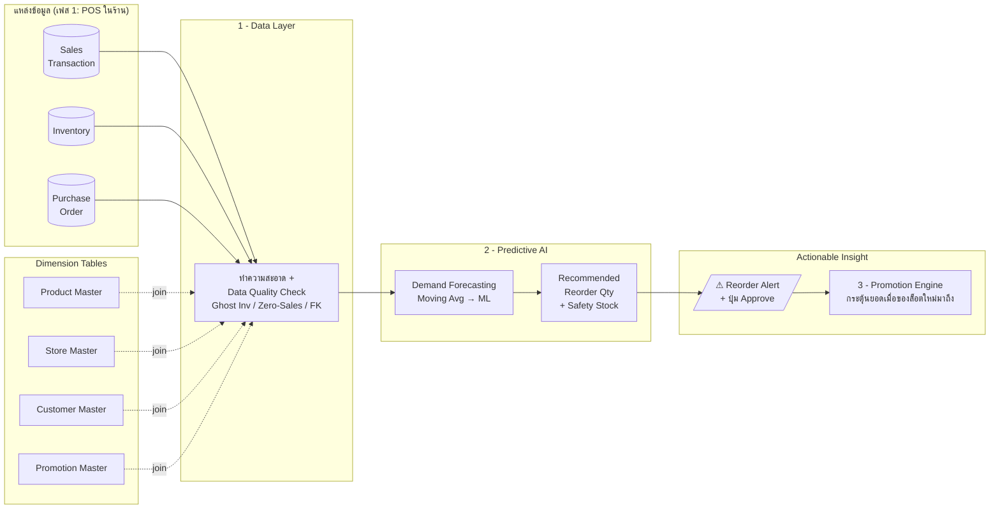
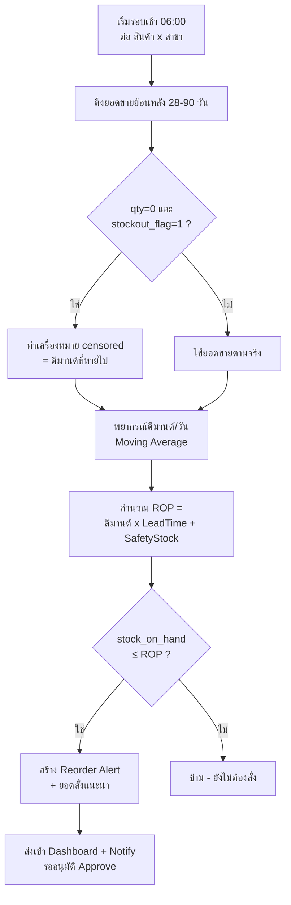

# System Workflow & Architecture

ไดอะแกรมอธิบายการไหลของข้อมูลและตรรกะการตัดสินใจ (อ้างอิงสไลด์หน้า 4)
GitHub เรนเดอร์ Mermaid ด้านล่างให้อัตโนมัติ

## 1. ภาพรวมสถาปัตยกรรม (Data → Decision → Action)

## 2. ตรรกะการตัดสินใจสั่งซื้อรายวัน (Daily Reorder Logic)

## 3. การทำงานแบบ Phased Approach

| เฟส | ขอบเขตข้อมูล | โมเดล | เป้าหมาย |
|---|---|---|---|
| **Phase 1 (MVP)** | POS ในร้าน (sales, inventory, PO) | Moving Average + Safety Stock | พิสูจน์ว่าลด Stockout ได้ ต้นทุนต่ำ เหมาะ SME |
| **Phase 2 (Scale)** | + Store Traffic, Zone, สภาพอากาศ, ปฏิทินท้องถิ่น | ML (Prophet / LightGBM) + Promotion Lift | แม่นยำขึ้น + วัด Lost Sales ได้จริง |
